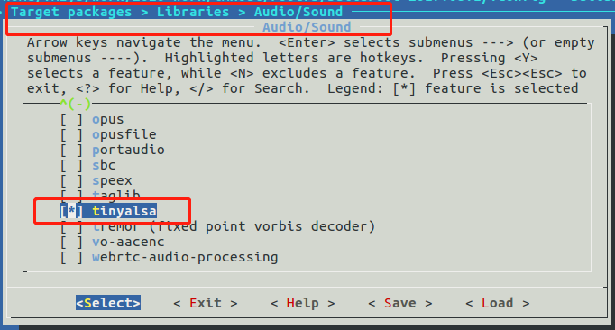
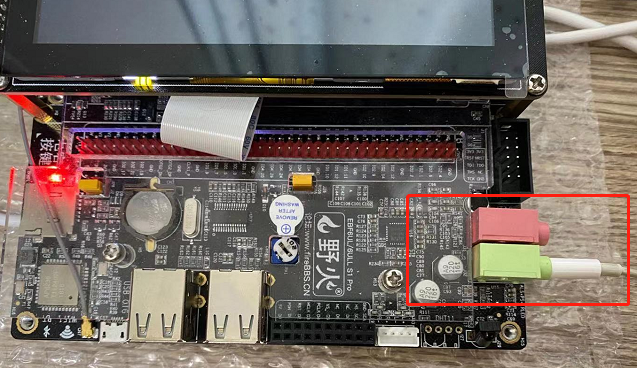

## 制作buildroot根文件系统(二)：使用tinyalsa播放音频


- 主机环境：ubuntu16.04-64bit
- 硬件版本：野火imx6ull-pro emmc


---


#### 一、制作根文件系统

详细的制作方法请参考：[制作buildroot根文件系统(一)：根文件系统和Qt5例程](buildroot2017-1.md)

本篇只介绍 buildroot 中关于 tinyalsa 的配置。

##### 1.关于 tinyalsa
目前 linux 中主流的音频体系结构是ALSA（Advanced Linux Sound Architecture），ALSA在内核驱动层提供了alsa-driver，在应用层提供了alsa-lib，应用程序只需要调用alsa-lib提供的API就可以完成对底层硬件的操作。

但是 ALSA 较为庞大，对于资源有限，可以满足需求的前提下，ALSA 的 简化版 tinyalsa 是个不错的选择。

tinyalsa 编译后会生成四个小工具：

- tinypcminfo
```
用于查看pcm通道的相关信息。
```
- tinymix
```
用于查看设置各项配置参数。
```
- tinycap
```
简易的录音软件，用于录音测试。
```
- tinyplay
```
用于播放测试，只能播放wav原始格式的音乐。
```

##### 2.配置buildroot

- 进入配置菜单
```
cd buildroot-2017.08.1/
make menuconfig
```

- 关键配置截图

选中 tinyalsa:



- 使用现成的配置

由于细节无法全面展现，新手可以使用我提供的现成配置。

点这里查看下载：[my-imx6u-buildroot2017-v1.0.config](https://github.com/Jmhh247/fireimx6-tutorial/blob/master/my-imx6u-buildroot2017-v1.0.config)

把我的配置文件复制到buildroot目录，并改名为.config。

```
cd buildroot-2017.08.1/

cp my-imx6u-buildroot2017-v1.0.config .config
```


##### 3.编译buildroot

很简单，直接make.

```
cd buildroot-2017.08.1/

time make
```

整个编译过程较长，可能达几个小时。

##### 4.生成的根文件系统和工具链位置
生成根文件系统位置：
```
buildroot-2017.08.1/output/images/rootfs.tar
```

制作好的工具链位置：
```
# arm-gcc
buildroot-2017.08.1/output/host/bin/arm-buildroot-linux-gnueabihf-

# qmake
buildroot-2017.08.1/output/build/qt5base-5.9.1/bin/qmake
```

有了ARMGCC工具链就可以编译linux，uboot，和你的应用程序等，本篇不涉及这些，不再展开介绍。

---
#### 二、测试根文件系统


开发板用的野火出厂固件，这里只替换根文件系统。

使用NFS挂载buildroot根文件系统来测试，操作方法如下 (里面用到的IP和相关目录，需要改成你的~)：

##### 1.解压根文件系统到NFS目录内

```
cd buildroot-2017.08.1/output/images/

sudo tar xvf rootfs.tar -C /nfsroot/imx6ull-nfs/buildroot2017-v1/

sync
```

##### 2.开发板从NFS启动根文件系统

进入uboot命令行设置启动参数：

- 设置bootargs
```
setenv bootargs "console=${console},${baudrate} root=/dev/nfs ip=192.168.2.102:192.168.2.119:192.168.2.1:255.255.255.0:imx6ull:eth0:off rootwait rw nfsroot=192.168.2.119:/nfsroot/imx6ull-nfs/buildroot2017-v1 consoleblank=0 init=/sbin/init";saveenv
```
- 设置bootcmd，设置后开发板自动从NFS启动
```
setenv bootcmd "mmc dev 1;mmc dev 1; mmc rescan;fatload mmc 1 0x80800000 zImage;fatload mmc 1 0x83000000 imx6ull-14x14-evk.dtb;bootz 0x80800000 - 0x83000000"
```

到这里，一切正常的话，系统就启动了！


```
Welcome to Buildroot
buildroot login: root
# cd /
# ls
bin      lib      media    proc     sbin     usr
dev      lib32    mnt      root     sys      var
etc      linuxrc  opt      run      tmp
#

# tiny
tinycap      tinymix      tinypcminfo  tinyplay
#

```

---
#### 三、测试 tinyalsa 播放音频

##### 1.使用 tinymix 配置声卡

系统启动后，声卡默认是关闭的，需要配置一下通道开关、音量等。


- 查询声卡参数

首先查询下当前状态，使用命令：

```
tinymix contents
```

查询到的结果如下：
```
# tinymix contents
Number of controls: 57
ctl     type    num     name                                    value
0       INT     2       Capture Volume                          39, 39 (range 0->63)
1       INT     2       Capture Volume ZC Switch                0, 0 (range 0->1)
2       BOOL    2       Capture Switch                          Off, Off
3       INT     1       Right Input Boost Mixer RINPUT3 Volume  0 (range 0->7)
4       INT     1       Right Input Boost Mixer RINPUT2 Volume  0 (range 0->7)
5       INT     1       Left Input Boost Mixer LINPUT3 Volume   0 (range 0->7)
6       INT     1       Left Input Boost Mixer LINPUT2 Volume   0 (range 0->7)
7       INT     1       Right Input Boost Mixer RINPUT1 Volume  0 (range 0->3)
8       INT     1       Left Input Boost Mixer LINPUT1 Volume   0 (range 0->3)
9       INT     2       Playback Volume                         255, 255 (range 0->255)
10      INT     2       Headphone Playback Volume               0, 0 (range 0->127)
11      BOOL    2       Headphone Playback ZC Switch            Off, Off
12      INT     2       Speaker Playback Volume                 0, 0 (range 0->127)
13      BOOL    2       Speaker Playback ZC Switch              Off, Off
14      INT     1       Speaker DC Volume                       0 (range 0->5)
15      INT     1       Speaker AC Volume                       0 (range 0->5)
16      BOOL    1       PCM Playback -6dB Switch                Off
17      ENUM    1       ADC Polarity                            , No InversionLeft InvertedRight InvertedStereo Inversion
18      BOOL    1       ADC High Pass Filter Switch             Off
19      ENUM    1       DAC Polarity                            , No InversionLeft InvertedRight InvertedStereo Inversion
20      BOOL    1       DAC Deemphasis Switch                   Off
21      ENUM    1       3D Filter Upper Cut-Off                 0 (range 0->7)
22      ENUM    1       3D Filter Lower Cut-Off                 0 (range 0->7)
23      INT     1       3D Volume                               0 (range 0->7)
24      BOOL    1       3D Switch                               0 (range 0->7)
25      ENUM    1       ALC Function                            , OffRightLeftStereo
26      INT     1       ALC Max Gain                            7 (range 0->7)
27      INT     1       ALC Target                              4 (range 0->15)
28      INT     1       ALC Min Gain                            0 (range 0->7)
29      INT     1       ALC Hold Time                           0 (range 0->15)
30      ENUM    1       ALC Mode                                , ALCLimiter
31      INT     1       ALC Decay                               3 (range 0->15)
32      INT     1       ALC Attack                              2 (range 0->15)
33      INT     1       Noise Gate Threshold                    0 (range 0->31)
34      BOOL    1       Noise Gate Switch                       Off
35      INT     2       ADC PCM Capture Volume                  195, 195 (range 0->255)
36      INT     1       Left Output Mixer Boost Bypass Volume   2 (range 0->7)
37      INT     1       Left Output Mixer LINPUT3 Volume        2 (range 0->7)
38      INT     1       Right Output Mixer Boost Bypass Volume  2 (range 0->7)
39      INT     1       Right Output Mixer RINPUT3 Volume       2 (range 0->7)
40      ENUM    1       ADC Data Output Select                  , Left Data = Left ADC;  Right Data = Right ADCLeft Data = Left ADC;  Right Data = Left ADCLeft Data = Right ADC; Right Data = Right ADCLeft Data = Right ADC; Right Data = Left ADC
41      BOOL    1       Mono Output Mixer Left Switch           Off
42      BOOL    1       Mono Output Mixer Right Switch          Off
43      BOOL    1       Right Output Mixer PCM Playback Switch  Off
44      BOOL    1       Right Output Mixer RINPUT3 Switch       Off
45      BOOL    1       Right Output Mixer Boost Bypass Switch  Off
46      BOOL    1       Left Output Mixer PCM Playback Switch   Off
47      BOOL    1       Left Output Mixer LINPUT3 Switch        Off
48      BOOL    1       Left Output Mixer Boost Bypass Switch   Off
49      BOOL    1       Right Input Mixer Boost Switch          Off
50      BOOL    1       Left Input Mixer Boost Switch           Off
51      BOOL    1       Right Boost Mixer RINPUT2 Switch        Off
52      BOOL    1       Right Boost Mixer RINPUT3 Switch        Off
53      BOOL    1       Right Boost Mixer RINPUT1 Switch        On
54      BOOL    1       Left Boost Mixer LINPUT2 Switch         Off
55      BOOL    1       Left Boost Mixer LINPUT3 Switch         Off
56      BOOL    1       Left Boost Mixer LINPUT1 Switch         On
#

```

- 经过测试，至少设置下面三项：

```
设置耳机音量
tinymix set 10 75

右声道
tinymix set 43 1

左声道
tinymix set 46 1
```

##### 2.使用 tinyplay 播放 wav 音频
准备一段wav格式的音乐，复制到根文件系统。

开始播放：
```
# ls
bin       lib       media     proc      sbin      usr
dev       lib32     mnt       root      sys       var
etc       linuxrc   opt       run       tmp       yzxd.wav
# tinymix set 10 75
# tinymix set 43 1
# tinymix set 46 1
# tinyplay yzxd.wav
playing 'yzxd.wav': 2 ch, 48000 hz, 16 bit
#
```


插上耳机欣赏音乐吧，耳机位置在这里：




---
*本篇完。*