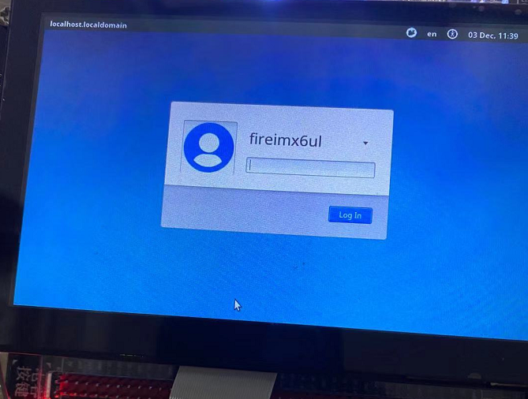
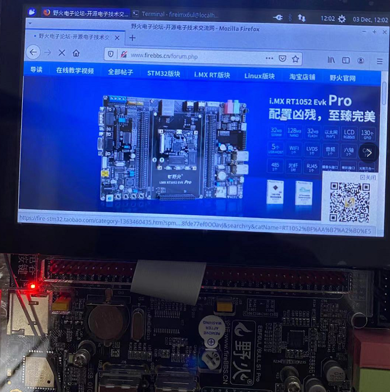

# 制作带桌面的ubuntu16根文件系统


- 主机环境：ubuntu16.04-64bit
- 硬件版本：野火imx6ull-pro emmc

2019-1203

---

#### 一、准备工作

1.创建工作目录

```
mkdir -p imx6ul-ubuntu16-rootfs/rootfs

cd imx6ul-ubuntu16-rootfs/
```


2.下载ubuntu-core

ubuntu官方下载页-[ubuntu16 cdimage下载](http://cdimage.ubuntu.com/ubuntu-base/releases/16.04/release/)


直接在命令行里下载最新的ubuntu-base-16.04.6-base-armhf.tar.gz：

```
wget http://cdimage.ubuntu.com/ubuntu-base/releases/16.04/release/ubuntu-base-16.04.6-base-armhf.tar.gz
```

3.解压ubuntu-core

```
sudo tar xzvf ubuntu-base-16.04.6-base-armhf.tar.gz -C rootfs/
```

4.安装 qemu

```
sudo apt install qemu-user-static -y
```

5.复制相关文件

写了几个脚本简化操作。

这里把相关脚本和sources.list复制到imx6ul-ubuntu16-rootfs目录内。

脚本内容在最后的附录给出，也可以在后面的云盘链接里面找到。

##### 准备工作结束后，imx6ul-ubuntu16-rootfs目录内是这样的：

```
.
├── chroot_mount.sh
├── chroot_run.sh
├── chroot_unmount.sh
├── rootfs
├── sources.list
└── ubuntu-base-16.04.6-base-armhf.tar.gz
```

---
#### 二、配置根文件系统

1.设置网络

直接复制ubuntu主机的。
```
sudo cp /etc/resolv.conf rootfs/etc/resolv.conf
```

2.复制qemu
```
sudo cp /usr/bin/qemu-arm-static rootfs/usr/bin/
sudo chmod +x rootfs/usr/bin/qemu-arm-static
```


3.替换国内镜像源

为了加速软件安装等，这里修改成国内源。

先备份，然后替换成新的。
```
sudo cp rootfs/etc/apt/sources.list rootfs/etc/apt/sources.list.bak

sudo cp sources.list rootfs/etc/apt/
```

4.使用chroot进入shell

用脚本操作，先挂载然后进入shell。

```
chmod +x chroot_mount.sh chroot_unmount.sh chroot_run.sh

./chroot_mount.sh

./chroot_run.sh
```

执行完上面的脚本会进入shell了：

```
root@linux-test:/# ls
bin   dev  home  media	opt   root  sbin  sys  usr
boot  etc  lib	 mnt	proc  run   srv   tmp  var
root@linux-test:/# 
```

进入shell后就可以安装各种你需要的软件了。

```
apt update
apt upgrade
```
```
apt install vim
apt install net-tools
apt install ethtool 
apt install ifupdown
apt install iputils-ping
```

5.安装桌面 (时间会比较长，如果不需要桌面可以跳过这步~)

```
apt install xubuntu-desktop
```

安装桌面可能会遇到错误：

```
Errors were encountered while processing:
 blueman
E: Sub-process /usr/bin/dpkg returned an error code (1)
```

解决方法，依次执行以下命令：

```
root@linux-test:/# mkdir var/lib/dpkg/info/
root@linux-test:/# apt-get -f install
root@linux-test:/# mv /var/lib/dpkg/info/* /var/lib/dpkg/info_old/
root@linux-test:/# rm -rf /var/lib/dpkg/info
root@linux-test:/# mv /var/lib/dpkg/info_old/ /var/lib/dpkg/info/
```


一切正常后可以测试下gcc:

```
root@linux-test:/# gcc -v
Using built-in specs.
COLLECT_GCC=/usr/bin/gcc
COLLECT_LTO_WRAPPER=/usr/lib/gcc/arm-linux-gnueabihf/5/lto-wrapper
Target: arm-linux-gnueabihf
Configured with: ../src/configure -v --with-pkgversion='Ubuntu/Linaro 5.4.0-6ubuntu1~16.04.12' --with-bugurl=file:///usr/share/doc/gcc-5/README.Bugs --enable-languages=c,ada,c++,java,go,d,fortran,objc,obj-c++ --prefix=/usr --program-suffix=-5 --enable-shared --enable-linker-build-id --libexecdir=/usr/lib --without-included-gettext --enable-threads=posix --libdir=/usr/lib --enable-nls --with-sysroot=/ --enable-clocale=gnu --enable-libstdcxx-debug --enable-libstdcxx-time=yes --with-default-libstdcxx-abi=new --enable-gnu-unique-object --disable-libitm --disable-libquadmath --enable-plugin --with-system-zlib --disable-browser-plugin --enable-java-awt=gtk --enable-gtk-cairo --with-java-home=/usr/lib/jvm/java-1.5.0-gcj-5-armhf/jre --enable-java-home --with-jvm-root-dir=/usr/lib/jvm/java-1.5.0-gcj-5-armhf --with-jvm-jar-dir=/usr/lib/jvm-exports/java-1.5.0-gcj-5-armhf --with-arch-directory=arm --with-ecj-jar=/usr/share/java/eclipse-ecj.jar --enable-objc-gc --enable-multiarch --enable-multilib --disable-sjlj-exceptions --with-arch=armv7-a --with-fpu=vfpv3-d16 --with-float=hard --with-mode=thumb --disable-werror --enable-multilib --enable-checking=release --build=arm-linux-gnueabihf --host=arm-linux-gnueabihf --target=arm-linux-gnueabihf
Thread model: posix
gcc version 5.4.0 20160609 (Ubuntu/Linaro 5.4.0-6ubuntu1~16.04.12) 
root@linux-test:/# 
```

有了gcc以后就可以在开发板编译程序了~


6.设置账户密码

```
useradd -s '/bin/bash' -m -G adm,sudo fireimx6ul
```

```
passwd fireimx6ul
```

```
passwd root
```

7.退出chroot

清除安装包
```
apt-get clean
```

退出shell
```
exit
```

取消挂载
```
./chroot_unmount.sh
```

删除qemu

```
sudo rm rootfs/usr/bin/qemu-arm-static
```

---
#### 三、打包与使用

- 打包根文件系统
```
cd rootfs/

sudo time tar cjvf ../ubuntu16-desktop-rootfs.tar.bz2 .
```

打包后在目录 imx6ul-ubuntu16-rootfs 里可以看到 ubuntu16-desktop-rootfs.tar.bz2 

- 使用根文件系统

开发板用的野火出厂固件，这里只替换根文件系统。

根文件系统可以直接用mfg工具通过USB烧录，但是测试阶段不推荐，因为烧录过程耗时太长。

##### 推荐使用NFS挂载ubuntu根文件系统来测试，操作方法如下 (里面用到的IP和相关目录，需要改成你的~)：
1.解压根文件系统到NFS目录内：

```
sudo tar xjvf ubuntu16-desktop-rootfs.tar.bz2 -C /nfsroot/imx6ull-nfs/ubuntu16-desktop-rootfs/

sync
```

2.开发板从NFS启动根文件系统

进入uboot命令行设置启动参数：

- 设置bootargs
```
setenv bootargs "console=${console},${baudrate} root=/dev/nfs ip=192.168.2.102:192.168.2.119:192.168.2.1:255.255.255.0:imx6ull:eth0:off rootwait rw nfsroot=192.168.2.119:/nfsroot/imx6ull-nfs/ubuntu16-desktop-rootfs consoleblank=0 init=/sbin/init";saveenv
```
- 设置bootcmd，设置后开发板自动从NFS启动
```
setenv bootcmd “mmc dev 1;mmc dev 1; mmc rescan;fatload mmc 1 0x80800000 zImage;fatload mmc 1 0x83000000 imx6ull-14x14-evk.dtb;bootz 0x80800000 - 0x83000000”
```

到这里，一切正常的话，就可以看到ubuntu启动了！


开机



浏览器



---

最后，整个编译过程较长，放个百度云出来，需要的朋友可以下载测试 (系统密码是：123456)：
```
链接：https://pan.baidu.com/s/1Jnd3HBh7H67FDKsVTNFjew 
提取码：5ikm 
复制这段内容后打开百度网盘手机App，操作更方便哦
```

---
#### 附录部分

- 相关脚本内容

chroot_mount.sh：
```
#! /bin/sh

sudo mount --bind /dev rootfs/dev/
sudo mount --bind /sys rootfs/sys/
sudo mount --bind /proc rootfs/proc/
sudo mount --bind /dev/pts rootfs/dev/pts/
```

chroot_unmount.sh:
```
#! /bin/sh

sudo umount rootfs/sys/
sudo umount rootfs/proc/
sudo umount rootfs/dev/pts/
sudo umount rootfs/dev/
```

chroot_run.sh:
```
#! /bin/sh

sudo LC_ALL=C LANGUAGE=C LANG=C chroot rootfs
```

- sources.list内容：

```
deb http://mirrors.ustc.edu.cn/ubuntu-ports/ xenial main multiverse restricted universe
deb http://mirrors.ustc.edu.cn/ubuntu-ports/ xenial-backports main multiverse restricted universe
deb http://mirrors.ustc.edu.cn/ubuntu-ports/ xenial-proposed main multiverse restricted universe
deb http://mirrors.ustc.edu.cn/ubuntu-ports/ xenial-security main multiverse restricted universe
deb http://mirrors.ustc.edu.cn/ubuntu-ports/ xenial-updates main multiverse restricted universe
deb-src http://mirrors.ustc.edu.cn/ubuntu-ports/ xenial main multiverse restricted universe
deb-src http://mirrors.ustc.edu.cn/ubuntu-ports/ xenial-backports main multiverse restricted universe
deb-src http://mirrors.ustc.edu.cn/ubuntu-ports/ xenial-proposed main multiverse restricted universe
deb-src http://mirrors.ustc.edu.cn/ubuntu-ports/ xenial-security main multiverse restricted universe
deb-src http://mirrors.ustc.edu.cn/ubuntu-ports/ xenial-updates main multiverse restricted universe
```

---


